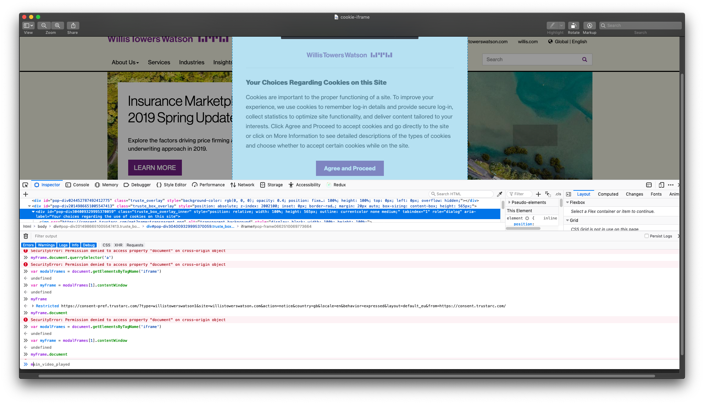

# Willis Towers Watson Technical Test

Using WebdriverIO & Cucumber.js

---

## Requirements

-   Node version of 8.10.0 may be required

## Quick start

1. You may need to have node version _8.10.0_. The node version manager is recommended for easy switching of node versions.

2. Run _'yarn install'_ to install dependencies

## Issues

1. A cookie iframe displays on entering the site.
   Normally I would write my test to switch to the iframe to access the iframe document in order to interact with the elements.
   This iframe is restrictive (please see attached screen shot) and '_denies permission to access the property document on cross-origin object_'
   This makes it difficult to close the cookie modal and would therefore be required to be closed manually for the successful execution of this test.
   
   

2. Some of my drivers and configuration are due for updates and [trouble shooting](https://github.com/webdriverio/webdriverio/issues/2631), hence some unusual server errors occur when using some methods of the WebdriverIO framework.
   I did not have enough time to troubleshoot these issues, however I have implemented a work around which produces some un-necessary error screenshots when executing the tests. These do not however affect the successful execution of the test.

#### Work around

Manually accept the cookie policy in the browser, in order for the test to run - apologies for that :-(

There is 5 seconds built into the test for this manual step.

1. A preferred work around would have been to supply the required cookies into the test.
2. Make the iframe less restrictive.

## How to run the test

To execute the tests, 
1. Run the following script ```$ yarn test```
2. Manually accept cookies and dismiss the cookie iframe by selecting the *Agreed and Proceed* button
3. To debug, place _'browser.debug()'_ in the steps and run ```$ yarn test:debug```
